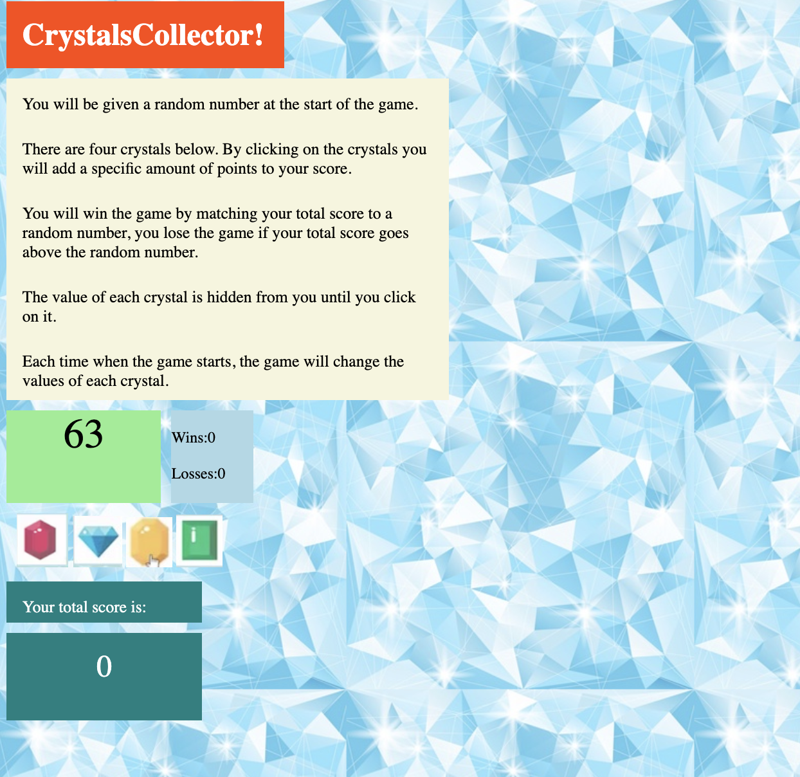

# unit-4-game

This is a README.md file for the repo unit-4-game.

* Used the jquery library to make the html more dynamic.
* Fun and interactive game for the user.

Here is how the game works:
   * There will be four crystals displayed as buttons on the page.

   * The player will be shown a random number at the start of the game.

   * When the player clicks on a crystal, it will add a specific amount of points to the player's total score. 

     * Your game will hide this amount until the player clicks a crystal.
     * When they do click one, update the player's score counter.

   * The player wins if their total score matches the random number from the beginning of the game.

   * The player loses if their score goes above the random number.

   * The game restarts whenever the player wins or loses.

     * When the game begins again, the player should see a new random number. Also, all the crystals will have four new hidden values. Of course, the user's score (and score counter) will reset to zero.

   * The app should show the number of games the player wins and loses. To that end, do not refresh the page as a means to restart the game.

     

<a href = 'https://dyuen510.github.io/unit-4-game/'>